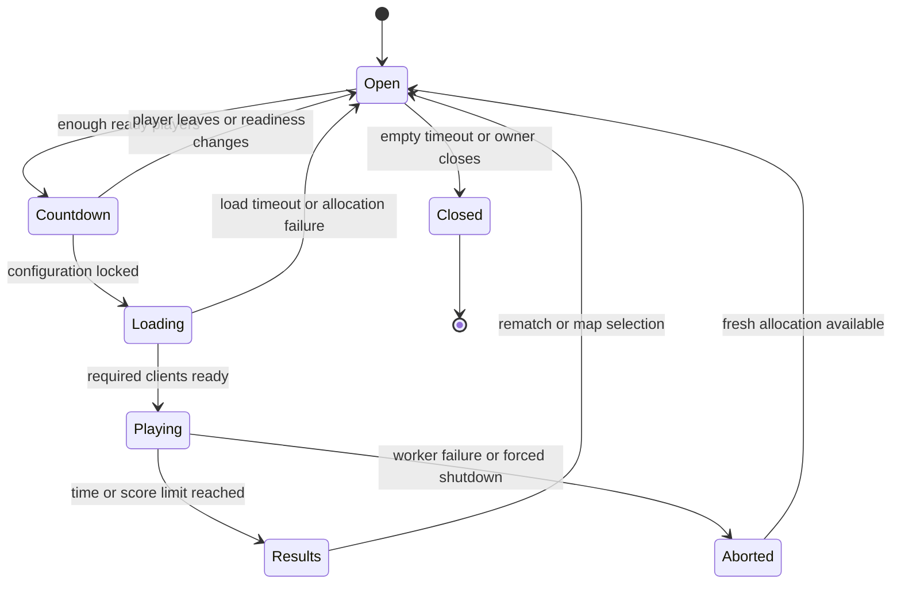

# dERP

**A browser arena platformer with serious foundations and deeply unserious firepower.**

Status: researched concept and proposed delivery plan. Written 31 August 2026.

This document describes what to build, why, in what order, and how to decide whether each addition works. It is not a claim that any of these systems already exist. The workspace was empty and was not a Git repository when inspected. No earlier prototype, character asset, authentication system, or infrastructure is assumed to be available.

## 1. The idea

dERP is a tongue-in-cheek multiplayer action platformer, rendered in 3D with Three.js but played entirely on a two-dimensional plane. Players run, jump, aim, and launch implausible quantities of ordnance around compact arenas. Death should produce a laugh, a clear understanding of what happened, and a quick route back into the fight.

The reference is the energy of old Soldat: side-view arena combat, independent movement and aiming, expressive traversal, distinctive weapons, and short gaps between encounters. Its original manual documents that combination of movement, jet-assisted traversal, weapon variety, and multiplayer modes. Those are useful design references, not a feature checklist or a player-capacity benchmark for a browser game. [Soldat manual](https://static.soldat.pl/man/manual-en.html)

dERP's own identity comes from exaggerated characters, absurd weapon presentation, ridiculous musical flourishes, and explosions that appear to have exceeded their budget. Underneath, movement, damage, collisions, and match outcomes must remain legible and dependable.

### Fixed requirements and proposed defaults

| Area | Status | Direction |
| --- | --- | --- |
| Browser game; Three.js; Bun | User requirement | Three.js renders the browser client; Bun runs the game backend and project tooling. Browser code still executes in the browser's JavaScript engine. |
| 3D appearance, 2D gameplay | User requirement | Authoritative positions, movement, aiming, and collisions use X/Y. Z provides visual depth only. |
| Multiplayer, proper auth, lobbies | User requirement | Server-owned matches, authenticated admission, explicit lobby lifecycle. |
| Multiple levels, characters, weapons | User requirement | Small initial set, expanded one item at a time through versioned content definitions. |
| Ridiculous soundtrack and explosions | User requirement | A defining part of the game, built within explicit visibility, accessibility, and performance budgets. |
| Strong foundation, incremental playtesting | User requirement | Every milestone ends with a playable build, evidence, and a decision to continue, revise, or remove. |
| Maximum players | Intentionally unresolved | Establish separately for each map/mode through human tests and performance measurements. |
| Initial audience | Proposed default | Desktop/laptop browsers, keyboard and mouse, casual private matches. |
| Initial mode | Proposed default | Free-for-all deathmatch; team modes follow only when the core loop works. |
| Characters | Proposed default | Cosmetic variation with identical gameplay dimensions and abilities initially. |
| Launch geography and spending | Open | Choose one initial hosting region around actual testers; set a spending ceiling before provisioning. |

## 2. What should make it good?

1. **Movement is enjoyable before shooting exists.** Responsive acceleration, useful air control, predictable jumping, and routes worth mastering.
2. **The chaos is readable.** Players can locate themselves, distinguish threats, see traversable surfaces, and understand damage even during the largest explosion.
3. **Multiplayer feels fair.** Local controls respond immediately; the server decides what happened. A slow or malicious client cannot set its own speed, health, damage, or score.
4. **Getting into another match is easy.** Clear sign-in, shareable private lobbies, understandable connection errors, short respawns, and uncomplicated rematches.
5. **Humour comes from the game.** Weapon names, animation, timing, sound, physics reactions, and environmental details carry the joke. Repeated UI jokes must not slow players down.
6. **Every feature earns its complexity.** Add the smallest playable version, test it, and only then deepen it.

The core loop is: join friends → choose a character/loadout → enter the arena → move, aim, shoot, improvise → explode or cause an explosion → respawn → finish a short round → rematch or change the map.

Initial tuning hypotheses, not commitments: five-minute rounds, two-to-three-second respawns, and brief spawn protection that ends on firing. Use score limits and time limits as lobby settings with server-enforced bounds. Measure whether these produce enough action without making individual decisions meaningless.

### Deliberate early exclusions

No campaign, ranked ladder, battle pass, inventory economy, paid advantages, global matchmaking, voice chat, user-uploaded content, in-browser map editor, seamless mid-match server migration, or fully destructible terrain in the first alpha. Mobile touch controls and gamepad support are later investigations. Do not build a generic engine, a universal ability framework, or distributed infrastructure in anticipation of hypothetical growth.

Jet-assisted traversal deserves an early experiment because it can change the entire game and every map. Wall-running, grappling, crouching, prone movement, and elaborate movement combos do not all enter that experiment. Begin with run, jump, air control, and one optional mobility mechanic.

## 3. Architecture decisions

These are recommended starting choices. Compatibility spikes below must validate exact pinned versions before implementation depends on them. Vendor benchmarks are not dERP benchmarks.

| Concern | Recommended starting choice | Reason and reconsideration trigger |
| --- | --- | --- |
| Language and repository | Strict TypeScript, Bun workspaces, one lockfile | Share simulation and protocol code without sharing server secrets. Pin runtime/dependency versions and type-check separately from transpilation. |
| Client development/build | Vite running under Bun | Straightforward asset handling and development feedback. Bun documents Vite support and the explicit `--bun` invocation. Native Bun frontend tooling is an alternative if it proves equally convenient for the actual asset pipeline. [Bun + Vite](https://bun.com/guides/ecosystem/vite) |
| Rendering | Three.js `WebGLRenderer`, WebGL2 baseline | Keep the first renderer and effects pipeline narrow. Evaluate WebGPU later against measured bottlenecks; do not maintain two bespoke effects implementations initially. [Three.js renderer guidance](https://threejs.org/manual/en/webgpurenderer.html) |
| Gameplay physics | Shared 2D kinematic controller, with Rapier2D as the preferred collision/query backend to validate | Retain control over arcade movement while avoiding an expanding homegrown collision engine. Keep the adapter small and specific. |
| Realtime transport | Native Bun WebSockets over WSS | Simple deployment and direct control over input, snapshots, admission, and queue limits. This does mean owning netcode and room lifecycle correctness. [Bun WebSockets](https://bun.com/docs/runtime/http/websockets) |
| Multiplayer model | Dedicated authoritative server, local movement prediction, reconciliation, remote interpolation | Responsive control without trusting client outcomes. |
| Auth | Better Auth, one OAuth/OIDC provider, database-backed sessions | Delegate protocol and session plumbing to maintained software. Its SQLite adapter documents `bun:sqlite` support; still prove the pinned combination. Avoid password login in the first release. [Better Auth installation](https://better-auth.com/docs/installation), [Bun SQLite adapter](https://better-auth.com/docs/adapters/sqlite) |
| Durable storage | SQLite on one host's local persistent disk for the invite alpha | Account/session/settings storage is modest; live matches stay in memory. Introduce PostgreSQL before distributed database access or write contention makes SQLite inappropriate. [Bun SQLite](https://bun.com/docs/runtime/sqlite) |
| Hosting | One region, persistent Bun processes, TLS reverse proxy, static assets | Ordinary managed process supervision is sufficient initially. Do not deploy the simulation as short-lived request functions. |
| Testing | Bun tests for simulation/protocol, browser automation for workflows, real hardware and humans for feel/performance | A passing unit suite does not establish that a multiplayer game is fun or smooth. [Bun test runner](https://bun.sh/docs/test), [Playwright browsers](https://playwright.dev/docs/browsers) |

### The alternatives worth checking now

**Colyseus:** A bounded comparison is worthwhile because room lifecycle, state synchronization, and current netcode features could save substantial work. Its current documentation describes prediction, reconciliation, and rewind, while its Bun transport documentation still labels Bun support experimental. Do not reject it using an old statement that it has no prediction; equally, do not assume its Bun integration is production-proven. Run the same two-client movement, reconnect, and overload scenario on the pinned versions. Adopt it only if it passes and clearly reduces total complexity. Stop the comparison after one agreed short spike; do not develop two game servers. Native Bun WSS is the fallback and current recommendation. [Colyseus netcode](https://docs.colyseus.io/netcode), [Colyseus Bun transport](https://docs.colyseus.io/server/transport/bun-websockets)

**WebTransport/WebRTC:** WebTransport now has broader current-browser availability than older advice suggests. Nevertheless, browser reach, Bun/server integration, hosting support, and operational complexity must all be verified together. Start with WSS; revisit transport if realistic network tests show that reliable ordered delivery creates unacceptable stalls. WebRTC peer hosting is not the default: it adds connectivity and authority complications without removing the need for trusted match services. [MDN WebTransport](https://developer.mozilla.org/en-US/docs/Web/API/WebTransport)

**Physics:** Validate Rapier2D initialization in Bun and the browser, slopes, one-way/drop-through platforms, high-speed sweeps, knockback, and prediction replay. Rapier's controller supplies collision-aware movement but does not supply the game's movement design. The documented deterministic behaviour depends on identical versions, inputs, initialization, and ordering; game code can still introduce differences. Server authority and correction remain necessary. If this spike fails, limit the first map to rectangles/one-way platforms with a small TypeScript swept controller and record the limitation before content production. Do not quietly accumulate both physics systems. [Rapier character controller](https://rapier.rs/docs/user_guides/javascript/character_controller/), [Rapier determinism](https://rapier.rs/docs/user_guides/javascript/determinism/)

### Proposed repository boundaries

```text
apps/
  client/          Three.js view, input, prediction, audio, accessible DOM UI
  server/          Bun entrypoints: control service and game worker
packages/
  simulation/      Fixed-step movement, collision adapter, weapons, match rules
  protocol/        Versioned messages, runtime validators, codecs, limits
  content/         Validated level, character, weapon and effect definitions
assets/           Source art/audio and licensing metadata
tools/            Asset validation, replay, synthetic clients, network harness
tests/            Cross-package integration and browser scenarios
docs/             Decisions, operating notes and playtest records as needed
```

This is a proposed layout, not a request to create all those folders now. The simulation must not import Three.js, the DOM, Bun networking, databases, or UI state. Presentation must not own gameplay truth. The client must never import account administration, credentials, or trusted server configuration.

Prefer plain modules and focused data structures over an entity-component framework initially. Introduce additional abstraction only when two real features need it. Menus and lobbies can use ordinary DOM components; a frontend framework, if chosen, must stay outside the per-frame game loop.

## 4. The simulation contract

### Coordinates, collision, and camera

- X is horizontal; Y is vertical; the authoritative world has no gameplay Z coordinate.
- Use consistent world units, one canonical character collision shape, and separately defined damage hitboxes if needed. Animation bones do not silently become hitboxes.
- Start with static level collision, one-way platforms, and simple hazards. Defer moving platforms until replay and timing are proven.
- Characters do not physically block each other initially. This avoids mutual-body prediction problems and spawn blocking; weapon damage and knockback still apply.
- Use an orthographic side camera initially. Aim maps the pointer to the fixed gameplay plane, independently of character travel direction.
- Set a consistent competitive view rectangle. Letterbox unsupported aspect ratios rather than giving wide monitors arbitrary extra visibility. Camera look-ahead must remain bounded and be tested against map sightlines.
- Foreground scenery must not conceal traversable edges or combatants. Add a collision/debug overlay before detailed art.

### Fixed-step execution

Start with a **60 Hz simulation**, **20 Hz authoritative snapshots**, and render independently at the display rate. These are hypotheses to benchmark, not guarantees of the final release. Inputs can be batched for transmission while retaining their simulation sequence.

Use an accumulator based on a monotonic clock; do not assume a timer fires precisely on schedule. Bound catch-up work, expose missed deadlines, and shed cosmetic work or admissions before sustained overload occurs. Do not stretch physics delta-time to hide overload. Fixed timesteps and headroom address the instability and runaway catch-up described in Glenn Fiedler's analysis. [Fix Your Timestep!](https://gafferongames.com/post/fix_your_timestep/)

Make simulation dependencies explicit: fixed timestep, validated input, content version, seeded gameplay randomness, and current state. Preserve stable ordering for entities and collision processing. Record enough state to replay a bug. Do not promise bit-identical full-game replay across all platforms until tests demonstrate it.

### Input, prediction, and reconciliation

1. The client samples buttons and pointer aim, assigns monotonically increasing input sequences, and immediately predicts its own movement using shared simulation code.
2. It sends intent: movement, jump/fire/reload edges or held state, aim, and allowed selections. It never sends authoritative position, damage, ammo, elapsed simulation time, or score.
3. The server validates the connection epoch, sequence, finite values, rate, allowable actions, and bounded input age against the established server/client tick mapping. It advances each player only according to server time; flooding commands cannot create extra simulated time. Expire stale movement and fire edges after a transport stall rather than executing a long backlog on recovery.
4. Snapshots contain the server tick, authoritative player state, relevant entities, and each recipient's input acknowledgment. The acknowledgment retires consumed inputs and explicitly identifies expired/rejected inputs so the client stops replaying them; an unusable timeline requires a fresh baseline. A client-supplied wall clock cannot extend this acceptance window.
5. The client restores its authoritative state and replays only valid unacknowledged inputs. Include velocity, grounded state, jump buffers, movement timers, and external impulses; restoring position alone is insufficient.
6. Correct simulation state immediately; smooth only small visual offsets. Large corrections, respawns, reconnects, and teleports reset interpolation and prediction history.
7. Render remote entities from a short snapshot buffer, initially around 100 ms and tuned using measured jitter. Bound extrapolation, then show degraded connectivity instead of inventing an unlimited future.

Keep prediction history bounded. If an acknowledgment is too old or histories are incompatible, perform a full resynchronization. Network timestamps inform bounded timing estimates but never permit arbitrary client-selected rewind or movement speed.

### Combat and latency

Start with projectile weapons: a fast-firing carbine and a visibly slower rocket launcher. This creates two useful combat styles without making historical hitscan rewind a prerequisite for the first playable fight.

- The server owns shot creation, muzzle validity, spread, fire cadence, ammunition, reload, projectile motion, collision, damage, knockback, death, respawn, and scoring.
- Use swept collision/shape or segment queries between projectile positions. Testing only its endpoint can miss thin walls or targets at high speed.
- Deduplicate fire edges with input/shot identifiers. A quick click between ticks must not disappear; retransmission or reconnect must not create an extra shot.
- Predict local muzzle flash, sound, and possibly a provisional tracer. Confirm or remove the provisional visual when authoritative results arrive; never predict a confirmed kill or duplicate the impact sound.
- Explosions have explicit radius, falloff, occlusion, self-damage, and impulse rules. Use authoritative geometry to stop blast damage through cover when the weapon's rules require it.
- Apply knockback through the movement state. A kinematic collision controller will not automatically turn arbitrary impulses into the desired arcade motion.
- Cosmetic recoil, screen shake, and hit pause do not pause the authoritative world or change mouse-to-world aiming.

If later weapons require hitscan, introduce a short server-owned history with capped lag compensation. Validate shot age against server-observed timing, prohibit arbitrary rewinds, define interactions with cover and moving geometry, and explicitly test the tradeoff between rewarding an accurate shot and being hit after reaching cover. Do not retroactively apply hitscan rules to every projectile.

### Protocol and bounded resources

Begin with inspectable, runtime-validated messages. TypeScript types alone do not validate incoming network data. Give the protocol and content manifest explicit versions; reject mismatches with a useful reload message.

Separate replaceable state snapshots from discrete actions/events. Snapshots recover current truth; reliable event delivery or bounded replay handles events still relevant to the client. Every event carries a unique ID, match generation, and server tick. Schedule remote projectile impacts, death visuals, and explosions against the same delayed presentation clock as remote movement, so an explosion does not precede the visible projectile. Reconcile immediate local effects by shot/event ID; shorten or skip obsolete cosmetic events that arrive too late. This never delays the server's damage calculation. Reconnecting players receive current state, not a theatrical replay of every old explosion.

Bound message size, messages per second, queued inputs, input history, entities, projectiles, pending events, lobby requests, and connection buffers. Suggested initial input limits are 2 KiB per command message and a rate limit above the legitimate 60 Hz input stream, with a short burst allowance; confirm batching behaviour before fixing the exact limit.

WebSocket provides reliable ordered delivery, which can delay newer state behind old bytes during loss or congestion. Bun exposes backpressure controls, while the browser WebSocket API does not provide automatic incoming backpressure. Replace stale snapshots before enqueueing them, monitor buffered bytes and data age, and disconnect/resynchronize persistently slow peers. Data already queued in the transport cannot simply be retracted. Do not assume an application-level dropped-message simulator reproduces TCP loss behaviour. [Bun WebSockets](https://bun.com/docs/runtime/http/websockets), [MDN WebSocket](https://developer.mozilla.org/en-US/docs/Web/API/WebSocket)

Use full snapshots first. Introduce quantization, a binary codec, or delta snapshots only when payload/CPU measurements justify them; a delta protocol needs explicit baselines and recovery after reconnect. Large asset downloads travel over HTTP, never through the game socket.

## 5. Identity, lobbies, and match lifecycle

### Accounts and sessions

Before invite-only online alpha, implement actual authentication using the selected maintained auth system and one provider. Do not create password storage, reset flows, OAuth validation, or session cryptography from scratch. Passwords, additional providers, and account-linking UX can wait.

Treat these identifiers separately:

| Identifier | Meaning |
| --- | --- |
| `accountId` | Stable internal person/account record, independent of display name. |
| `sessionId` | Revocable authenticated browser session. |
| `connectionId` / epoch | One live socket attachment; replaced on reconnect. |
| `lobbyId` | The group and its configuration across rounds. |
| `matchId` / generation | One immutable round/allocation identity. |
| `playerId` | Participant entity inside a particular match. |

Display names, avatars, invite links, and client-supplied IDs never prove ownership. Provider identity uses the provider's stable subject; do not merge users by matching display names or guessed email equivalence. Use the library's explicit safe linking process if more providers are added.

Prefer same-origin HTTPS/WSS deployment, host-only Secure/HttpOnly cookies, appropriate SameSite policy, explicit trusted origins, and the auth library's CSRF/OAuth protections. Keep bearer credentials out of local storage, URLs, logs, and analytics. Configure session expiration and revocation deliberately. [Better Auth security](https://www.better-auth.com/docs/reference/security), [OWASP WebSocket security](https://cheatsheetseries.owasp.org/cheatsheets/WebSocket_Security_Cheat_Sheet.html)

### Admission is an authorization operation

1. The authenticated control service checks the live session, bans, lobby membership/invitation, match state, client versions, and available capacity.
2. It reserves a seat with a short expiration and creates a short-lived, single-use opaque join ticket bound to account, session, room, match generation, and game-server allocation.
3. The browser opens WSS to the allocated endpoint. Validate Origin and connection limits before expensive work. Send the ticket as the first application message, not as a URL query parameter; the socket is otherwise inert and closes quickly if admission does not complete.
4. The game worker requests admission from the control process over private IPC using a unique operation ID. Control owns the reservation/ticket ledger and rechecks the current session, bans, membership, and match/allocation generation before atomically consuming the ticket and committing the seat/connection epoch. Concurrent joins cannot overfill the room or consume one reservation twice.
5. The worker attaches only the committed identity/epoch and sends the current match snapshot. An IPC timeout is an unknown outcome, not permission to admit or allocate a replacement seat: reconcile using the same operation ID or fail closed. Unused reservations expire; committed seats are released through an explicit detach/expiry transition.

The control process is the single authority for lobby membership and capacity, including pending, committed, and reconnect-reserved seats; one game worker owns each match's simulation. Keep IPC bounded and reconcile attachment/detachment with the control ledger. On control restart, refuse admission until live allocations have been reconciled or explicitly aborted. A future multi-host design will need atomic shared reservation storage and explicit routing; an in-process map is not a distributed lock.

Recheck live session validity on reconnect and periodically during play; push revocation to workers where possible and invalidate outstanding tickets. Disable auth session cookie caching initially so a stale cached session cannot silently extend validity. Set an initial upper target of 30 seconds for revocation to reach an active socket, and fail closed if validity cannot be established at the deadline. Logout, bans, and expired sessions must have documented effects on connected clients.

### Lobby and match states



Every transition has one authoritative owner, a timeout where relevant, and an idempotency key or state/version check. A retry cannot start a second match, duplicate a result, or allocate two seats. Match settings and map/content hashes are frozen before loading.

Initial lobby capabilities: private invite, authenticated membership, capacity display, ready status, map choice, character/loadout choice, start/countdown, leave, kick/ban, results, rematch. Reject new joins to a playing round initially with a clear message, except authenticated reconnects into unexpired reserved seats; reserve general join-in-progress and spectators for a later decision. Changing lobby configuration resets readiness. Public discovery comes after abuse controls and capacity gates.

The lobby owner has configuration privileges, not simulation authority. On owner departure, transfer ownership deterministically to an eligible member or close an empty lobby. A match does not stop because its creator leaves.

Allow a provisional 15-second reconnect grace. Reserved reconnect seats count toward the cap. Reconnection requires authenticated proof of the same account and an allowed current session; it replaces the previous connection epoch. Reject concurrent active control from a second tab/account attachment. Old sockets and packets cannot resume control after replacement.

On disconnect, stop held input. During grace, the character remains in the world, vulnerable, with normal gravity/physics; it receives no safety advantage from unplugging the network. Reconnect restores its actual state, including death. Expired grace removes the entity and releases the seat. This policy needs explicit playtesting and may be revised with an equivalent abuse-resistant alternative.

### Browser lifecycle and abuse

On blur, release held input and suppress accidental page shortcuts only when the game has focus. On hidden-tab/sleep recovery, clear stale input and resynchronize. Server-side input expiry is still required because the browser may not send a final message. Hidden pages commonly stop animation callbacks and throttle timers. [MDN Page Visibility](https://developer.mozilla.org/en-US/docs/Web/API/Page_Visibility_API)

Before the invite alpha becomes remotely accessible: rate limits by session/account and IP with allowances for shared networks; bounded unauthenticated sockets, auth requests and lobby creation; high-entropy invites with guess limits and expiry; escaped names with length limits; kick/ban authorization; and an operator audit trail. Add basic player reporting and safe, paginated lobby listings before public discovery. Free-text chat and uploads remain disabled initially. Origin checks protect browser sessions but are not a substitute for authentication or a defence against custom malicious clients.

Server authority mitigates impossible gameplay commands; it does not eliminate aimbots, information extraction, denial of service, or griefing. Do not advertise the game as cheat-proof. Keep secrets off clients and add narrower interest filtering only if visibility rules or measured bandwidth require it.

## 6. Characters, levels, weapons, and spectacle

### Data-driven content, not an unrestricted scripting platform

Use small versioned schemas with stable IDs. Server-approved definitions determine gameplay; clients cannot submit arbitrary weapon statistics, collider data, or scripts. Separate public content from operational secrets, and give each match an immutable content manifest/hash.

| Content | Required definition |
| --- | --- |
| Level | ID/version, bounds, static colliders, one-way surfaces, spawn points, kill zones, supported modes, camera limits, intended occupancy, visual asset references. |
| Character | ID, visual asset, normalized scale/origin, animation mapping, weapon sockets, palette/silhouette rules, licensing reference. |
| Weapon | ID, fire mode, cooldown, ammo/reload, projectile/hitscan policy, damage/falloff, spread/recoil, collision/occlusion rules, visual/audio references. |
| Effect | ID, particle/light/decal/voice budgets, lifetime, priority, quality variants, flash/shake behaviour. |
| Music | ID, loop points, intensity/stem metadata, transition points, gain settings, licence/attribution and permitted distribution. |

Validate at build time and server startup. Fail with an actionable error if a required clip, collider, spawn point, or gameplay asset is missing. A cosmetic download failure may fall back to an obvious placeholder only if the player can still play fairly; a missing map collision version cannot.

### Levels

Start with a greybox arena containing at least two routes between important areas, vertical choices, cover, and no spawn with an unavoidable immediate line of fire. Measure travel time and encounter density before decorating it.

Use Tiled object layers/custom properties as the initial candidate for authoring 2D gameplay geometry and metadata; use Blender/glTF for scenery. Compile both into one validated level manifest with a documented coordinate transform. The server loads gameplay geometry only. Tiled exposes custom properties suitable for attaching these meanings to map objects. [Tiled custom properties](https://doc.mapeditor.org/en/stable/manual/custom-properties/)

Do not derive authoritative collision from a decorative 3D mesh at runtime. Show collision overlays in development and compare them visually to surfaces players expect to land on. Exporting a second level should require content changes, not a second movement implementation.

Suggested later settings, purely creative starting points: an industrial yard with irresponsibly stacked fuel tanks; a rooftop with questionable safety rails; a server room whose incident response involves rockets. Each map needs a different tactical shape, not only a new backdrop.

### Characters

Use glTF/GLB for animated models. Load shared assets once, clone skeleton state per player, and dispose instances without destroying shared geometry/textures still in use. Three.js provides `SkeletonUtils.clone` for correctly cloning skinned hierarchies. Keep rendering and animation separate from collision and input. [SkeletonUtils](https://threejs.org/docs/pages/module-SkeletonUtils.html), [GLTFLoader](https://threejs.org/docs/pages/GLTFLoader.html)

Define the animation contract early: idle, locomotion, airborne/jump, landing, firing/reload overlays where useful, and death. Retarget incoming assets to that contract or supply explicit mappings. Animation anticipation must not delay a validated jump command, and root motion must not move the authoritative player. Aim, facing, and travel direction can differ.

First establish one character, then add a second to prove the pipeline. Keep stats and collision identical. Distinct abilities would multiply balance and networking cases and need their own milestone later.

### Weapons

Deliver one dependable carbine, then one rocket launcher, then test before expanding. After the core works, add one contrasting weapon at a time: a spread weapon, a lobbed explosive, or a precision weapon. Each must change decisions about distance, cover, timing, or movement.

Weapon humour should wrap clear behaviour: for example, a launcher with an excessively formal warning label and an undignified recoil animation. A joke is not a reason for unreadable projectiles or unpredictable damage. Self-damage and rocket jumping are explicit balancing decisions, not accidental consequences.

### Explosions

The server emits a compact authoritative explosion event: ID, tick, position, gameplay type and deterministic seed where needed. Damage and impulse are resolved there. The client creates the smoke, flash, debris, shock ring, audio, and camera reaction from that event. Do not network individual sparks or decorative fragments.

Build a reusable layered effect: readable impact core → short flash → expanding ring → debris → smoke → decay. Keep physical scale, sound, timing, and recoil consistent with the gameplay radius even when decorative pieces travel farther.

Pool common particles and decals; batch compatible particles/props; cap overdraw, transparent screen coverage, lights, voices, and total lifetime. Prefer baked/static lighting and a few transient lights over a shadow-casting light per explosion. Texture compression, draw-call reduction, and resource budgets matter as much as polygon counts. [MDN WebGL best practices](https://developer.mozilla.org/en-US/docs/Web/API/WebGL_API/WebGL_best_practices), [Three.js KTX2Loader](https://threejs.org/docs/pages/KTX2Loader.html)

Define a worst-case effect scene as soon as rockets exist: all players firing near each other, repeated deaths, overlapping smoke, and nearby camera shake. Quality scaling drops decorative particles, smoke duration, light count, and resolution before dropping gameplay cues. It must never remove a hazardous projectile, obscure a hitbox differently in a competitively meaningful way, or change physics.

Defer terrain destruction and gameplay debris. They introduce new replicated geometry, collision history, map balance, and performance problems. Decorative debris can fly into the visual Z dimension precisely because it cannot damage or block anyone.

### Soundtrack and audio

Suggested musical direction: energetic breakbeats or heavy riffs, mock-heroic brass, and occasional outrageously cheap-sounding accents. Establish an original identity; do not depend on commercial tracks being available for redistribution.

Start with one properly looping track and a few excellent weapon/impact sounds. Add menu music, round-end stings, and intensity layers later. Switch or crossfade on musical boundaries where practical; avoid restarting a track on every death or network correction.

Use separate master, music, effects, and UI buses; voice priorities and concurrency caps; positional attenuation; a comfortable dynamic-range option; and short music ducking around critical cues. Louder is not the only way an explosion can feel large. Do not make continuous music streaming a prerequisite for joining a match.

Browsers restrict audio autoplay, so the explicit Play/Enter action should initialize or resume audio. Loading, muted playback, and recovery after tab suspension need clear UI. Persist volume/mute preferences and offer a mode that disables any music not cleared for recording/streaming. [MDN Web Audio best practices](https://developer.mozilla.org/en-US/docs/Web/API/Web_Audio_API/Best_practices)

Maintain an asset register from the first imported file: source, author, licence, modifications, attribution, and intended web/game/streaming distribution. Original or appropriately licensed art/audio is a release gate; research this per asset instead of assuming a generic licence covers every use.

### Comfort and accessibility

Ship remappable controls, visible focus, keyboard-operable menus, readable text, contrast-aware player markers, and signals that do not rely only on colour or stereo hearing. Provide separate controls for camera shake, flashes, motion, gore/debris, music, and effects. Honour reduced-motion preferences as an initial setting, with explicit in-game overrides.

Extreme effects still need flash-safety review. WCAG's three-flashes guidance is a useful minimum reference, not a blanket certification that an arbitrary game effect is safe. Test overlapping effects, not just one explosion. Warning screens do not substitute for safer defaults and a reduced-effects mode. [W3C flashes guidance](https://www.w3.org/WAI/WCAG22/Understanding/three-flashes-or-below-threshold.html), [W3C animation from interactions](https://www.w3.org/WAI/WCAG22/Understanding/animation-from-interactions.html)

## 7. Establishing player capacity

There are three different numbers: **the number that is fun on a map**, **the number one room can simulate and render acceptably**, and **the total concurrent players the deployment can afford**. Do not substitute any one of them for another.

Test room sizes in steps: **2 → 4 → 8 → 12 → 16**. Try 24 or 32 only if evidence at 16 and the map design justify it. These are test points, not promised supported capacities. A four-player small map may be more enjoyable than a technically stable sixteen-player version.

For each size, run human matches, a reproducible combat stress scenario, and a synthetic networking test. Bots can generate work but cannot establish fun; headless clients also cannot establish GPU performance.

### Initial engineering budgets

All values below are provisional acceptance targets. Nothing in this document is a measured result. During the first foundation milestone, name the actual reference machines, OS/browser versions, resolution, server CPU/RAM allocation, and connection conditions in a benchmark record.

| Measure | Initial target and measurement context |
| --- | --- |
| Standard rendering | 60 FPS intent during a five-minute combat run at 1080p/medium on the named reference laptop. On a nominal 60 Hz display, start with p95 frame interval ≤ 18 ms and p99 ≤ 34 ms to allow scheduling/timer tolerance; record actual refresh rate, presented FPS, missed refreshes, long frames, and CPU/GPU work where available. Evaluate higher-refresh displays against their configured render target. |
| Low-quality fallback | 30 FPS intent at 720p/low on the named lower-tier integrated-GPU machine, with all critical cues retained. State clearly if that tier is not achieved. |
| Server tick work | At 60 Hz, total simulation/snapshot work scheduled within one process's 16.7 ms interval: p95 ≤ 8 ms, p99 ≤ 12 ms; track scheduling delay separately. Do not multiply per-room budgets beyond a process's capacity. |
| Normal network | Test 40 ms RTT without added impairment and 100 ms RTT with ±20 ms jitter and 1% transport packet loss. Movement should remain controllable and state should converge after recovery. |
| Degraded network | Test 200 ms RTT, ±40 ms jitter, 2% loss, short outages and slow receivers. Show connection degradation; avoid unbounded queues, duplicate actions, and invalid state. This is a resilience target, not a promise of equal competitive fairness. |
| Prediction quality | Under the normal impaired profile, aim for p95 corrections below 10% of character width during ordinary movement. Report large-correction frequency separately; exclude and label respawn/teleport/authoritative combat impulses. Calibrate after the first prototype. |
| Gameplay bandwidth | Initial steady-state budget per player: average ≤ 64 kB/s downstream and ≤ 8 kB/s upstream, excluding assets. Also record burst p95/p99 and worst-case effects; tighter budgets may be possible. |
| Cold start | Initial playable asset transfer ≤ 10 MB compressed; aim for interactive entry within 10 seconds on a named device with 20 Mbps download/50 ms RTT, including decode/compile. Defer optional tracks/maps. |
| Stability | One-hour combat soak at the candidate cap; no crashes, accumulating rooms/listeners, or steadily growing post-warm-up memory. Verify repeated joins/leaves and at least 20 map/round transitions. |
| Capacity headroom | Reserve roughly 30% of measured server capacity for burst load before admitting more rooms; use the stricter CPU, queue, memory, or tick limit. |

Tune provisional thresholds from evidence, but record changes and their reason. Do not relax a failed target simply to label a build complete.

### Bandwidth and hosting cost

With full room snapshots, approximate outbound payload traffic is:

```text
egress bytes/second ≈ recipients × snapshots/second × snapshot bytes
                     + discrete event traffic
```

Snapshot size grows with players and active projectiles, so broadcasting everything to everyone can approach quadratic growth in player count. As a calculation example only, 16 recipients × 20 snapshots/s × 1,500 bytes is 480,000 bytes/s: about 3.84 Mbps or 1.73 GB per room-hour, before protocol overhead, retransmission, and assets. The 1,500-byte snapshot is an assumption, not a measurement or an MTU recommendation.

Record actual egress, CPU, memory, and storage per occupied room-hour. Set cost alerts and maximum room allocations before opening public discovery. More VPS cores cannot fix a poor player experience on a low-end GPU.

### Human capacity test

At each occupancy, inspect encounter frequency, deaths shortly after spawn, time alive, traversal freedom, weapon concentration, visibility during explosions, perceived fairness, and willingness to rematch. Compare the same map at adjacent player counts with mixed-skill testers and rotated order.

Promote a map/mode cap only after at least three sessions at the candidate occupancy, including representative slower hardware and normal impaired networking, plus the engineering soak. Small samples guide design rather than proving statistical conclusions. If fun peaks at eight but performance survives sixteen, eight can be the default. Hard admission limits must never exceed the validated cap for that content/build.

## 8. Delivery plan

Use ordered milestones, not speculative calendar promises. There is no known team capacity or asset-production budget yet. Split each milestone into changes small enough to review and playtest; do not combine every listed item into one large pull request.

### Milestone 0 — Prove the foundation choices

**Deliver:** Bun/TypeScript workspace; explicit package boundaries; minimal Three.js scene; headless simulation entrypoint; runtime-validated protocol; one-command development/check/build scripts; CI; initial diagnostics; pinned dependencies. No art production or account UI yet.

**Bounded investigations:** Run the physics/controller spike and the native Bun/Colyseus comparison only as described above. Pin a viable auth library/database/provider combination in a throwaway compatibility test before relying on it. Record decisions, rejected alternatives, reference hardware, and the initial hosting budget/region assumptions.

**Playable outcome:** Two browser windows connect to a local authoritative room, see two simple shapes, and move them using shared simulation code. This is a rough networking proof, not finished game feel. The test endpoint is local or explicitly access-restricted, with no unauthenticated public server.

**Exit gate:** Clean install/check/build in CI; browser bundle contains no server imports; the server runs without a browser; malformed input is rejected; the two clients converge on server state; measurements can be captured. Do not advance with an unresolved fundamental runtime or physics incompatibility.

### Milestone 1 — Movement worth mastering

**Deliver:** Greybox traversal course; tuned run/jump/air control; input buffering and a short coyote-time experiment; slopes/one-way/drop-through behaviour if the physics gate passed; fixed camera/aim mapping; prediction/reconciliation/interpolation; blur/disconnect handling; replayable movement scenarios.

Experiment with one jet/boost mechanic in a separate configuration. Compare it against the base movement, then keep, revise, or remove it before building final map routes. Animation remains a presentation concern.

**Playtest:** Solo traversal plus two humans on separate machines. Test edges, ceilings, reversals, narrow platforms, 60/120/144 Hz displays where available, focus changes, and 40/100/200 ms RTT profiles.

**Exit gate:** Movement is enjoyable without weapons; ordinary movement meets the agreed correction budget; no tunnelling/falling through supported geometry; held input expires safely; repeated input traces reproduce the same supported outcomes. Record remaining feel issues before combat hides them.

### Milestone 2 — First complete firefight

**Deliver:** One greybox deathmatch map; carbine followed by rocket launcher; authoritative health/ammo/reload/projectiles/explosions/death/respawn/score; simple HUD; round timer/results/rematch; one layered explosion and basic weapon audio. Use anonymous test identities only inside the trusted development harness.

**Playtest:** Two players, then four. Test crossing projectiles, simultaneous kills, walls near muzzles, self-damage, spawn safety, shooting while reloading, death during a held trigger, and repeated round resets. Compare matches with effects at minimum and maximum.

**Exit gate:** A complete five-minute match and rematch work without manual reset; duplicate messages cannot create extra damage or scores; all clients agree on outcomes; people want another round. The combat stress scene is recorded and repeatable. No content expansion to compensate for weak movement or unsatisfying shooting.

### Milestone 3 — Safe invite-only multiplayer alpha

**Deliver:** Proper provider login and revocable sessions; durable profile/settings; private lobbies/invites; atomic reservations and join tickets; ready/countdown/loading lifecycle; owner transfer; reconnect; kick/ban; initial single-region TLS deployment and operator diagnostics. Split control/database work from the timed game loop before deployed alpha.

**Playtest:** Friends join through a real URL with distinct accounts, play, leave, reconnect, change owner, and rematch. Use actual separate devices/networks, not only two tabs on one laptop.

**Exit gate:** Expired/replayed/wrong-room tickets, revoked sessions, simultaneous last-seat joins, duplicate tabs, stale connection epochs, malformed packets, origin violations, loading timeouts, and worker restarts behave safely. Test backup restoration and rollback. Match capacity remains the smaller of the validated count and the configured alpha limit. This is the first externally accessible game milestone; authentication is not deferred until after launch.

### Milestone 4 — Establish dERP's identity and content pipeline

**Deliver incrementally:** First animated character, then a second; first finished map, then a second with a different layout; one additional weapon at a time; a licensed/original looping soundtrack; expressive sound design; effect quality presets; control remapping and reduced-effects settings. Keep one known-good map/loadout for comparison.

**Playtest after each addition:** Can players recognize the character/weapon, locate themselves during an explosion, understand the new route or weapon tradeoff, and still hear important cues? Test fresh downloads, missing assets, compressed texture support, shader warm-up, and repeated asset disposal.

**Exit gate:** A second character and level require content definitions rather than custom networking; silhouettes agree with gameplay dimensions; no asset/licensing gaps; high and low quality remain fair; standard rendering and load budgets pass. The soundtrack is enjoyable over several rounds, not merely in a short demo.

### Milestone 5 — Determine and publish the supported capacity

**Deliver:** Automated load scenarios, transport impairment tests, renderer stress scenes, measured room-allocation limits, and a written per-map/mode capacity recommendation. Test 8, 12, and 16 only as earlier steps pass; lower counts already tested in previous milestones remain useful baselines.

**Optimize in evidence order:** Remove unnecessary simulation/render work; reduce allocations and overdraw; improve entity limits and asset budgets; then consider encoding/deltas, interest management, or a transport change. Re-run correctness and fairness tests after each optimization.

**Exit gate:** The candidate cap passes repeated human sessions, the one-hour soak, network resilience, reference-browser/hardware checks, and the agreed hosting-cost ceiling. Document the default fun count, hard per-room cap, and deployment-wide room limit separately. Do not market an untested larger number.

### Milestone 6 — Broader alpha and deliberate expansion

**Deliver:** Public lobby discovery if desired; abuse/reporting basics; operational runbooks and alerts; compatibility/help UI; polished loading/reconnect flows; content licence inventory; recovery and retention policies. Add team deathmatch, then consider capture-the-flag as separate feature experiments with dedicated map/spawn design.

**Exit gate:** New players can sign in, join, understand the controls, finish a match, and rematch without a developer guiding them. Deployments drain matches cleanly; failures are diagnosable; spending and capacity are bounded; no known critical auth or gameplay-integrity defect remains.

Possible later directions: more weapons/characters/maps, spectators, replays, bots for practice, gamepads, regional placement, custom servers, or destructible set pieces. Each needs a concrete problem/opportunity and a new bounded plan. Nothing in that list blocks the first good game.

## 9. How development and playtesting work

Each change follows the same loop: state one hypothesis → implement the smallest playable version → run relevant checks → playtest → inspect measurements and observations → keep, revise, or remove → record the decision.

Use short feature branches, focused reviews, and a playable main branch. Record architectural decisions when they affect protocol, authority, content, or persistence. Use feature flags for experiments, but remove abandoned paths instead of collecting permanent switches.

### Verification layers

| Layer | Cases that matter |
| --- | --- |
| Simulation | Collision boundaries, jump timing, fast projectiles, weapon cooldown/reload, damage/occlusion, spawn protection, round ending, deterministic ordering, replay fixtures. |
| Protocol/security | Runtime validation, NaN/infinity, oversized messages, sequence abuse, command floods, wrong versions, unauthorized operations, expired/replayed tickets, stale epochs. |
| Integration | Multiple clients, simultaneous joins, reconnect during death/loading/results, owner departure, worker failure, session revocation, exactly-once result persistence. |
| Browser workflows | Login/lobby/match/rematch, keyboard focus, pointer mapping, resize/aspect ratios, hidden tabs, sleep/wake, audio unlock, asset failure and context loss. |
| Performance | Real rendering under maximum legal combat, slow receivers, transport impairment, repeated round transitions, allocation/GC and buffer growth. |
| Human | Movement satisfaction, readability, fairness, map flow, weapon purpose, comfort, soundtrack fatigue, rematch desire. |

Use Playwright's Chromium/Firefox/WebKit coverage for functional smoke tests; it does not replace real Safari/Chrome/Firefox hardware testing or validate representative GPU performance. Test the supported desktop browsers explicitly, and show a helpful unsupported-WebGL2 screen. [Playwright browser support](https://playwright.dev/docs/browsers)

Use an application harness for message delay/duplicates/reconnect edge cases and a transport-level network emulator/proxy or OS facility for real TCP delay/loss/bandwidth limits. A synthetic bot connects through the public protocol and respects server input rules; it must not bypass the workload it is meant to measure.

### Playtest record

For every session, capture: build/content version; date; map/mode and occupancy; devices/browser versions and quality settings; RTT/jitter/loss conditions; the hypothesis; frame/tick/bandwidth/correction percentiles; disconnects/errors; what confused or delighted players; a short fairness/readability/comfort rating; and the next decision.

Start with 20–30-minute focused sessions and one main question. After a candidate milestone, run several rounds without developer intervention. Include a new player periodically: familiarity hides onboarding problems. Keep identifiable telemetry minimal, avoid recording credentials or raw private conversation, and define retention before gathering remote-player diagnostics.

## 10. Deployment, persistence, and recovery

Initially use a single host in one region with two responsibilities: a control service for auth/lobbies/persistence and a game process for bounded live rooms. They may share source packages and the same deployment without sharing a busy event loop. Bun documents subprocess/IPC facilities suitable for a local boundary; validate lifecycle and queue limits in the actual implementation. [Bun process spawning](https://bun.com/docs/runtime/child-process)

Durable data includes accounts/provider links, sessions, settings, bans, and any deliberately retained match summaries. Transient data includes movement, projectiles, current round state, and reconnect reservations. Do not write per-tick state to SQLite. The control process owns database migrations/writes; game workers submit small idempotent result records keyed by match ID. An aborted round must not be recorded as a valid completed result.

If using SQLite, use a persistent local volume, deliberate WAL/busy-timeout configuration, serialized migrations, and a supported online backup procedure. Restore-test backups, including data written while WAL is active; copying only a live main database file is not the backup plan. Do not put a shared SQLite database on a network filesystem. Verify the actual bundled SQLite version and auth adapter behaviour when pinning Bun. [SQLite WAL](https://www.sqlite.org/wal.html), [SQLite online backup](https://www.sqlite.org/backup.html)

In front, serve HTTPS/WSS with the correct upgrade and timeout settings. Serve versioned assets with cache-friendly hashes and compatible headers. Keep secrets in server configuration, restrict internal worker/control interfaces, and include dependency/security updates in maintenance.

Expose health/readiness, active rooms/connections, tick delay/duration, memory, outbound bytes, admission rejection reasons, and errors tagged with build/match/room IDs. Separate ordinary latency corrections from security events. Do not use client-reported FPS as proof of server health.

On deploy, stop admitting new matches to the old worker, allow bounded draining, and then retire it. Keep clients pinned to their match's protocol/content version. On unexpected worker loss, tell players the round was aborted and return them to a recoverable lobby; do not claim a live match was preserved. Restarting a process is recovery, not seamless migration or high availability.

Keep the previous deployable version and test rollback. Before public access, decide acceptable account-data recovery loss/time and configure backups accordingly. Only add PostgreSQL, shared reservation storage, additional regions, or an orchestration platform when the measured load and reliability requirements justify them.

## 11. Risks and decisions to revisit

| Risk or open question | Response / decision point |
| --- | --- |
| The game works but movement is dull | Movement-only gate before combat/content expansion; test a single mobility mechanic early. |
| Network authority feels sluggish | Prediction and reconciliation in the first real movement milestone; measure correction and TCP stalls before selecting optimizations. |
| Rapier or Colyseus behaves differently under Bun | Bounded pinned-version compatibility spikes; document a fallback; no migration based on a marketing claim. |
| Effects destroy frame rate or hide combat | Mandatory worst-case scene, pooled/budgeted effects, low-quality fairness and flash review. |
| More players makes the game worse | Map-specific human capacity gates; do not equate maximum connections with fun. |
| Content workload overwhelms engineering | One canonical rig, content validators, small initial asset set, and the second-item pipeline gate. |
| Account/lobby races permit duplicates or unauthorized play | Explicit IDs, atomic reservations, single-use tickets, connection epochs, and adversarial integration tests. |
| Auth/DB work stalls the game | Separate control and simulation execution; no database access inside ticks; measure event-loop delay. |
| Costs grow through egress or idle rooms | Room TTLs, admission ceilings, egress metrics and cost alerts before public discovery. |
| A single server fails | Honest aborted-match recovery, restore-tested durable data, runbook; evaluate redundancy only against agreed availability needs. |
| Music/art cannot be shipped or streamed | Asset register and per-asset review before integration/release. |
| Jet movement changes every map | Decide in Milestone 1, before finished map production. |
| Exact browser/hardware floor is unknown | Name and measure reference machines in Milestone 0; publish supported limits only after testing. |
| Character abilities, gore style, team modes, monetization remain open | Keep proposed conservative defaults; revisit independently without blocking the foundation. |

## 12. The next concrete step

After reviewing this idea, implement **Milestone 0 only**. Its concrete result is a tiny, instrumented, two-client authoritative playground with a validated shared simulation and an explicit technology decision record.

The first success is being able to change movement, reproduce a bug, connect two real clients, see what the server decided, measure the result, and confidently add the next small piece.

Research notes: linked sources are primary documentation or original technical writing, consulted on 31 August 2026. Their capabilities inform this proposal; they do not certify dERP's performance, security, compatibility, or player capacity. Numerical budgets, content examples, and milestone gates are project recommendations to validate through implementation and playtesting.
